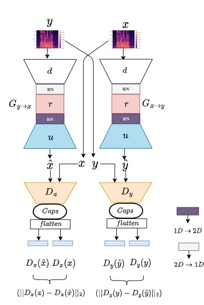

# RNCapsGAN-VC
**PyTorch** implementation of T Akhter's et al.'s **RNCapsGAN-VC** (2023) for non-parallel voice conversion.

RNCapsGAN-VC is a new proposed method for non-parallel voice conversion using SOTA CycleGAN framework. It is trained using a novel normalization technique and Capsule networks.


<p align="center">

<br>
<b>Figure 1: RNCapsGAN-VC Architecture</b>
<br><br><br><br>
</p>

## Setup

Clone the repository.

```
git clone git@github.com:BlueBlaze6335/RNCapsGAN-VC.git
cd RNCapsGAN-VC
```

## VCC2018 Dataset

The authors of the paper used the dataset from the Spoke task of [Voice Conversion Challenge 2018 (VCC2018)](https://datashare.ed.ac.uk/handle/10283/3061). This is a dataset of non-parallel utterances from 6 male and 6 female speakers. Each speaker utters approximately 80 sentences.

Download the dataset from the command line.
```
wget --no-check-certificate https://datashare.ed.ac.uk/bitstream/handle/10283/3061/vcc2018_database_training.zip?sequence=2&isAllowed=y
wget --no-check-certificate https://datashare.ed.ac.uk/bitstream/handle/10283/3061/vcc2018_database_evaluation.zip?sequence=3&isAllowed=y
wget --no-check-certificate https://datashare.ed.ac.uk/bitstream/handle/10283/3061/vcc2018_database_reference.zip?sequence=5&isAllowed=y
```

Unzip the dataset file.
```
mkdir vcc2018
apt-get install unzip
unzip vcc2018_database_training.zip?sequence=2 -d vcc2018/
unzip vcc2018_database_evaluation.zip?sequence=3 -d vcc2018/
unzip vcc2018_database_reference.zip?sequence=5 -d vcc2018/
mv -v vcc2018/vcc2018_reference/* vcc2018/vcc2018_evaluation
rm -rf vcc2018/vcc2018_reference
```

## Data Preprocessing

To expedite training, we preprocess the dataset by converting waveforms to melspectograms, then save the spectrograms as pickle files `<speaker_id>normalized.pickle` and normalization statistics (mean, std) as npz files `<speaker_id>_norm_stats.npz`. We convert waveforms to spectrograms using a [melgan vocoder](https://github.com/descriptinc/melgan-neurips) to ensure that you can decode voice converted spectrograms to waveform and listen to your samples during inference.

```
python data_preprocessing/preprocess_vcc2018.py \
  --data_directory vcc2018/vcc2018_training \
  --preprocessed_data_directory vcc2018_preprocessed/vcc2018_training \
  --speaker_ids VCC2SF1 VCC2SF2 VCC2SF3 VCC2SF4 VCC2SM1 VCC2SM2 VCC2SM3 VCC2SM4 VCC2TF1 VCC2TF2 VCC2TM1 VCC2TM2
```

```
python data_preprocessing/preprocess_vcc2018.py \
  --data_directory vcc2018/vcc2018_evaluation \
  --preprocessed_data_directory vcc2018_preprocessed/vcc2018_evaluation \
  --speaker_ids VCC2SF1 VCC2SF2 VCC2SF3 VCC2SF4 VCC2SM1 VCC2SM2 VCC2SM3 VCC2SM4 VCC2TF1 VCC2TF2 VCC2TM1 VCC2TM2
```


## Training

Train RNCapsGAN-VC to convert between `<speaker_A_id>` and `<speaker_B_id>`. You should start to get excellent results after only several hundred epochs.
```
python -W ignore::UserWarning -m RNCapsGAN.train \
    --name RNCapsGAN_<speaker_id_A>_<speaker_id_B> \
    --seed 0 \
    --save_dir results/ \
    --preprocessed_data_dir vcc2018_preprocessed/vcc2018_training/ \
    --speaker_A_id <speaker_A_id> \
    --speaker_B_id <speaker_B_id> \
    --epochs_per_save 100 \
    --epochs_per_plot 10 \
    --num_epochs 502 \
    --batch_size 1 \
    --lr 1e-4 \
    --decay_after 1e4 \
    --sample_rate 22050 \
    --num_frames 64 \
    --max_mask_len 25 \
    --gpu_ids 0 \
```

To continue training from a previous checkpoint in the case that training is suspended, add the argument `--continue_train` while keeping all others the same. The model saver class will automatically load the most recently saved checkpoint and resume training.

Launch Tensorboard in a separate terminal window.
```
tensorboard --logdir results/logs
```

## Testing

Test your trained RNCapsGAN-VC by converting between `<speaker_A_id>` and `<speaker_B_id>` on the evaluation dataset. Your converted .wav files are stored in `results/<name>/converted_audio`.

```
python -W ignore::UserWarning -m mask_RNCapsGAN_vc.test \
    --name RNCapsGAN_VCC2SF3_VCC2TF1 \
    --save_dir results/ \
    --preprocessed_data_dir vcc2018_preprocessed/vcc2018_evaluation \
    --gpu_ids 0 \
    --speaker_A_id VCC2SF3 \
    --speaker_B_id VCC2TF1 \
    --ckpt_dir /data1/RNCapsGAN_VC/RNCapsGAN_VCC2SF3_VCC2TF1/ckpts \
    --load_epoch 500 \
    --model_name generator_A2B \
```

Toggle between A->B and B->A conversion by setting `--model_name` as either `generator_A2B` or `generator_B2A`.

Select the epoch to load your model from by setting `--load_epoch`.

## Code Organization
```
├── README.md                       <- README.
├── .gitignore
├── LICENSE
|
├── args
│   ├── base_arg_parser             <- arg parser
│   ├── train_arg_parser            <- arg parser for training (inherits base_arg_parser)
│   ├── RNCapsGAN_train_arg_parser  <- arg parser for training RNCapsGAN-VC (inherits train_arg_parser)
│   ├── RNCapsGAN_test_arg_parser   <- arg parser for testing RNCapsGAN-VC (inherits base_arg_parser)
│
├── bash_scripts
│   ├── RRCapsGAN_train.sh          <- sample script to train RNCapsGAN-VC
│   ├── RRCapsGAN_test.sh           <- sample script to test RNCapsGAN-VC
│
├── data_preprocessing
│   ├── preprocess_vcc2018.py       <- preprocess VCC2018 dataset
│
├── dataset
│   ├── vc_dataset.py               <- torch dataset class for RNCapsGAN-VC
│
├── logger
│   ├── base_logger.py              <- logging to Tensorboard
│   ├── train_logger.py            <- logging to Tensorboard during training (inherits base_logger)
│
├── saver
│   ├── model_saver.py              <- saves and loads models
│
├── RNCapsGAN
│   ├── model.py                    <- defines RNCapsGAN-VC model architecture
│   ├── train.py                    <- training script for RNCapsGAN-VC
│   ├── test.py                     <- training script for RNCapsGAN-VC
│   ├── utils.py                    <- utility functions to train and test RNCapsGAN-VC
│   ├── layers.py                   <- model layers used to train and test RNCapsGAN-VC

```

## Acknowledgements

This repository was inspired by the implementation of [MaskCycleGAN-VC](https://github.com/GANtastic3/MaskCycleGAN-VC).
